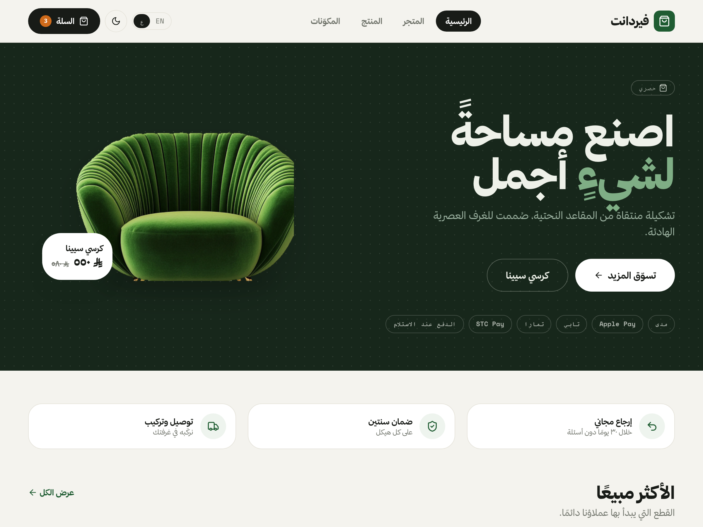
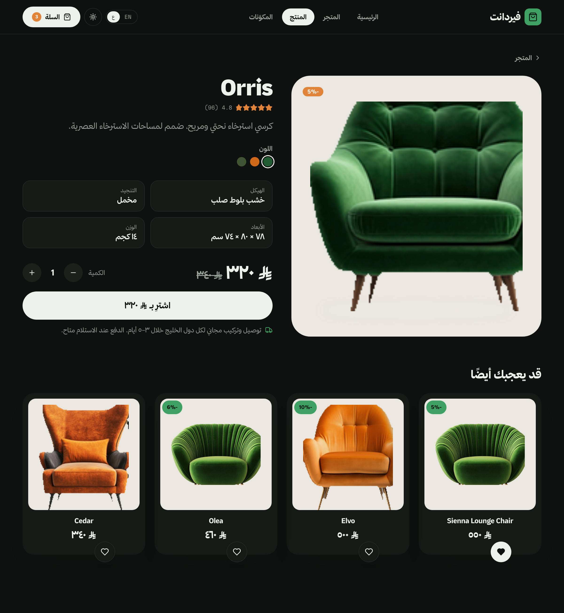
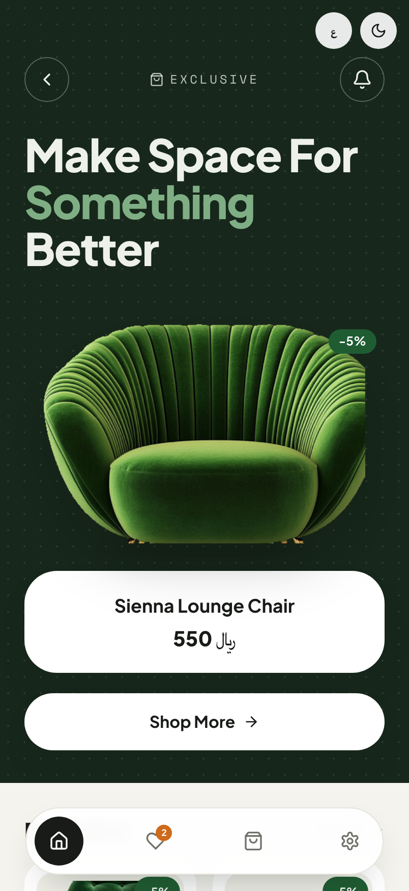
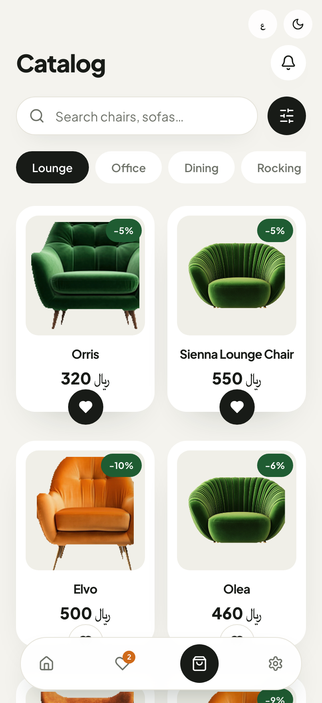
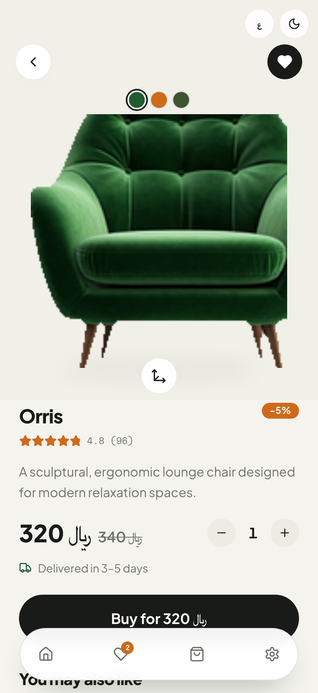

# Verdant — premium furniture storefront kit

A runnable **ecommerce storefront** UI kit for [uikit.studio](https://uikit.studio):
a calm, premium furniture store (chairs &amp; lounge seating) in emerald green with a
warm-orange accent on a cream canvas. **Arabic-first (RTL) for the Saudi / Khaliji
market**, EN + AR, light + dark. Mobile-first, responsive to desktop.

> Built by [**KernelCode**](https://github.com/KernelCode) · `type: ecommerce`

<video src="https://github.com/KernelCode/verdant-uikit/raw/main/screenshots/preview.webm" poster="https://github.com/KernelCode/verdant-uikit/raw/main/screenshots/landing.png" muted loop autoplay playsinline width="100%"></video>

> Video not playing? [▶ Watch the preview ↗](https://github.com/KernelCode/verdant-uikit/raw/main/screenshots/preview.webm)

```bash
npx uikit-cli new https://github.com/KernelCode/verdant-uikit my-store
cd my-store/react && pnpm install && pnpm dev
```

## Screens

| | |
| --- | --- |
| **Storefront** (`/`) | Dark-green "Make Space For Something Better" hero, featured chair, bestsellers, perks, payment/trust row. |
| **Catalog** (`/products`) | Search, category pills, a product grid of chairs, and (desktop) a price/category/sort filter rail. |
| **Product** (`/product`) | Image, color swatches, rating, price + sale, quantity, **Buy** — plus specs &amp; related on desktop. |
| **Cart** (`/cart`) | Line items, free-shipping progress, summary with **VAT 15%**, and local payment options. |
| **Components** (`/components`) | The design-system showcase: color, type, radius, and every component. |

**Desktop**





**Mobile** (matched to the source design)

<p>
  
  
  
</p>

## Design system

- **Color** — emerald brand (`#1f5c32`), terracotta accent (`#cf6a1a`), cream
  background (`#f4f3ee`), near-black actions (`#181b17`); a deep-forest "ink" hero.
  Full light **and** dark token sets.
- **Type** — Plus Jakarta Sans (display + body), Space Mono (prices &amp; micro-labels),
  **Thmanyah Sans** for Arabic (auto-swapped under `[dir="rtl"]`).
- **Radius** — soft and generous: `sm .625rem` → `2xl 2.5rem`; chips/buttons go pill.

Everything lives as tokens in [`design/theme.css`](design/theme.css) (Tailwind v4
`@theme`) and [`design/tokens.json`](design/tokens.json) (W3C DTCG). Reference them
with `rounded-[var(--radius-lg)]` (Tailwind v4 — `rounded-[--radius-lg]` is a no-op).

## Saudi / Khaliji storefront

Arabic is the first-class locale (full RTL), prices in **SAR (﷼)**, **VAT 15%** in the
cart, and local payments surfaced as trust badges + checkout options: **mada · Apple
Pay · Tabby · Tamara · STC Pay · COD (الدفع عند الاستلام)**, with a free-shipping bar.

## Use this design with an AI agent

Verdant is **agent-ready**. Point any AI editor at this repo (or `AGENTS.md` +
`llms.txt`) and ask:

> Build me a furniture store styled exactly like this design:
> github.com/KernelCode/verdant-uikit — match its tokens, fonts, radius and components.

## Tech

React + Vite, Tailwind v4, `react-router-dom`, lucide icons. The chair imagery lives in
`react/src/assets/products/` as transparent cutouts. Run `npx uikit-cli validate` after
changes.

---

MIT © [KernelCode](https://github.com/KernelCode)
